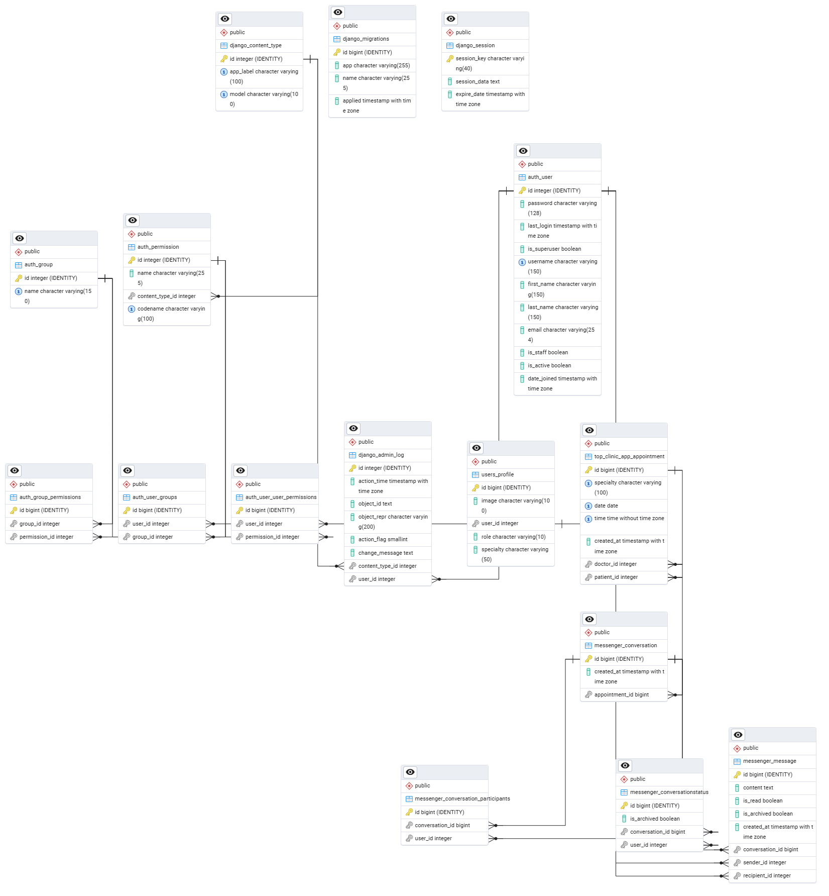

# Top Clinic

**Top Clinic** is a web platform that emulates a real-life medical clinic. Users can consult medical specialties available, learn about the clinic and contact. When a patient decides to register, they are able to create or cancel appointments. Doctors can manage appointments.

[Top Clinic on Render](https://top-clinic.onrender.com/)

---

## Features

### General Users (Patients)
- Register an account (all frontend registrations create patients).
- Create and cancel appointments.
- Update personal profile, including username, email, and profile picture.
- Log in and log out.
- Password reset functionality is planned but not yet implemented.

### Doctors
- Log in and manage appointments.
- View or cancel patient appointments.
- Update personal profile, including username, email, and profile picture.

### Superusers / Admins
- Create and manage doctor accounts.
- Assign specialties to doctors.
- Edit any user's profile and account details.
- Full control over appointments and patient data.

---

## Authentication

All users can log in/out, with role-based access controlling their available features.

**Note:** For testing purposes, all accounts use the same password: `testPwd!`

| Username     | Email address                | First name | Last name  | Role      | Specialty                  |
|--------------|------------------------------|------------|------------|-----------|----------------------------|
| admin        | luis_rangel2001@hotmail.com  | Admin      | User       | Superuser | N/A                        |
| test.user1   | lapdfssd@gmail.com           | Luis       | Almeida    | Patient   | N/A                        |
| llippard0    | llippard0@unblog.fr          | Lorena     | Lippard    | Patient   | N/A                        |
| bpellissier0 | bpellissier0@netvibes.com    | Baillie    | Pellissier | Doctor    | General Medicine           |
| ebienvenu3   | ebienvenu3@google.pl         | Ebba       | Bienvenu   | Doctor    | Dermatology                |
| esmallbone5  | esmallbone5@businesswire.com | Editha     | Smallbone  | Doctor    | Gynecology & Obstetrics    |
| mmalloch4    | mmalloch4@jiathis.com        | Marcille   | Malloch    | Doctor    | Orthopedics                |
| mturpin7     | mturpin7@youtu.be            | Marvin     | Turpin     | Doctor    | Psychiatry & Mental Health |
| narmsden1    | narmsden1@sourceforge.net    | Nanci      | Armsden    | Doctor    | Pediatrics                 |
| rpotkin2     | rpotkin2@goo.ne.jp           | Roldan     | Potkin     | Doctor    | Cardiology                 |
| zgrishinov6  | zgrishinov6@google.co.jp     | Zorah      | Grishinov  | Doctor    | Neurology                  |

---

## How It Works / Architecture

The **Top Clinic** platform is built using Django following the standard MVC (Model-View-Template) architecture.

### Models (Database Layer)
- **User & Profile**: Store account and personal details (role, specialty, profile image).
- **Appointment**: Stores appointment data linked to patients and doctors.
- **Messages**: Optional patient-doctor communication. This feature can be used on existing appointments.
- **Database**: PostgreSQL managed via Django ORM with migrations.

### Views & Templates
- **Views**: Handle requests for registration, login, profile updates, and appointments.
- **Templates**: Render pages with **Bootstrap 5** for responsive design.
- **Forms**: Styled using **Django Crispy Forms**.

### Media & File Storage
- Profile images and other media are uploaded to **Cloudinary**, which provides optimization and a CDN for delivery.

### Authentication & User Flow
1. Patients register via the frontend.
2. Doctors are created by superusers via the Django Admin.
3. Role-based dashboards control access to features.
4. Profile updates and appointment management trigger database changes.

### Deployment
- Hosted on **Render.com** with **Gunicorn** as WSGI server.
- **Whitenoise** serves static files; **Cloudinary** serves media files.

> 

---

## Workflow Diagram

```
Frontend Users
     |
     v
  Register/Login
     |
     v
Patients ------------------> Doctors
     |                          |
Create/Cancel Appointments       v
     |                   Manage Appointments
     v                          |
 Update Profile -----------------
```

---

## Tech Stack

- **Backend**: Django 4.2, Django REST Framework
- **Frontend**: HTML5, CSS3, Bootstrap 5, Crispy Forms
- **Database**: PostgreSQL, Django ORM
- **File Storage**: Cloudinary
- **Deployment**: Render.com, Gunicorn, Whitenoise
- **Development Tools**: Python 3.13, VS Code, Node.js & npm

---

## Project Setup

### 1. Environment
```bash
python -m venv venv
venv\Scripts\activate
python -m pip install --upgrade pip
pip install -r requirements.txt
```

### 2. Database
- Create tables:
```bash
python manage.py makemigrations
python manage.py migrate
```
- Create a superuser:
```bash
python manage.py createsuperuser
```

### 3. Run Development Server
```bash
python manage.py runserver
```

---

## Documentation & Resources

- [Django Official Documentation](https://docs.djangoproject.com/en/5.2/)
- [Django REST Framework](https://www.django-rest-framework.org/)
- [Python Official Documentation](https://docs.python.org/3/)
- [Bootstrap 5](https://getbootstrap.com/docs/5.3/getting-started/introduction/)
- [Crispy Forms](https://django-crispy-forms.readthedocs.io/)
- [Cloudinary Storage for Django](https://cloudinary.com/documentation/django_integration)
- [Stack Overflow](https://stackoverflow.com/) - troubleshooting and Q&A
- [Reddit - r/django / r/python](https://www.reddit.com/r/django/) - community discussions
- [w3schools - Django Tutorials](https://www.w3schools.com/django/)
- [Mockaroo - Generate Mock Data](https://www.mockaroo.com/)
- [Pexels - Free stock images](https://www.pexels.com/)
- [Canva - Logo and graphic creation](https://www.canva.com/)
- [Favicon.io - Convert images to favicon](https://favicon.io/favicon-converter/)

---

## Images & Media

- Profile images are uploaded via Cloudinary.
- Other media resources: Pexels, Canva, Favicon.io, DeepAI (optional AI image generation).